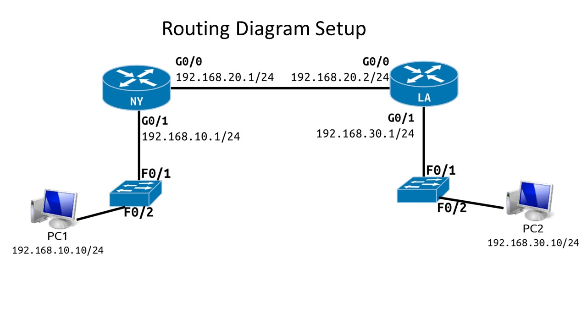

# packet_tracer_ospf_routing

## Overview
Configuration of OSPF (Open Shortest Path First) as a dynamic routing protocol between two routers, allowing them to automatically discover and advertise routes using link-state information rather than manual static route entries.

## Topology
Reference:

Result:

Two routers (Router-1 and Router-2) connected together.
- Router-1: 192.168.10.1/24 (LAN), 192.168.20.1/24 (point-to-point link to Router-2)
- Router-2: 192.168.30.1/24 (LAN), 192.168.20.2/24 (point-to-point link to Router-1)

## Configuration
Added OSPF routing on both routers using area 1.

- Router-1:
    - router ospf 1
    - network 192.168.10.0 0.0.0.255 area 1
    - network 192.168.20.0 0.0.0.255 area 1

- Router-2:
    - router ospf 1
    - network 192.168.20.0 0.0.0.255 area 1
    - network 192.168.30.0 0.0.0.255 area 1

## Issues / Troubleshooting
Verified OSPF neighbor adjacency and route advertisement using 'do sh ip route' to confirm routers had formed a neighbor relationship and learned each other's networks.

## What This Demonstrates
Understanding of OSPF as a link-state routing protocol, including configuration, area assignment, and neighbor verification. Unlike RIP which uses hop count, OSPF uses cost based on bandwidth to determine the best path making it more scalable and efficient in larger networks.